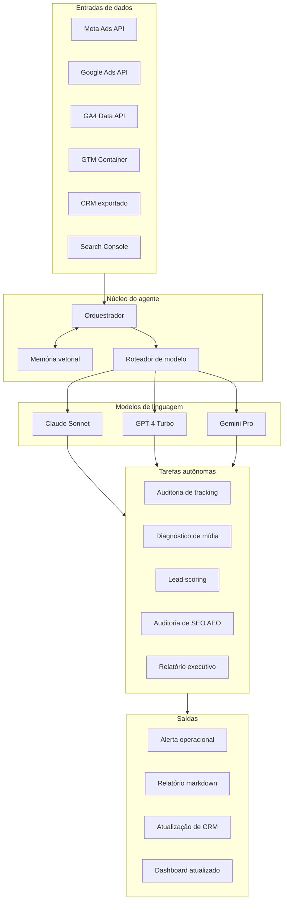

# Agente autônomo de growth marketing, arquitetura conceitual

Sistema proprietário em produção que executa diagnóstico de mídia paga, auditoria de tracking, lead scoring preditivo e auditoria de SEO no formato 2026 (otimização para resposta de mecanismo de IA), de forma autônoma e contínua, vinte e quatro horas por dia.

Este repositório contém a arquitetura conceitual do sistema, sem código fonte, porque a implementação é proprietária e está atendendo cliente em produção. O que está aqui é suficiente para explicar como o sistema pensa, decide e age, em nível compatível com conversa técnica de Head de Growth ou Lead de AI Engineering.

## Para que serve

Substituir o ciclo manual de gestor de tráfego que, em qualquer agência ou time interno de growth, consome de quatro a oito horas por dia em tarefas que são, no fundo, padronizáveis. Auditar pixel, conferir evento, ler relatório, anotar anomalia, sugerir teste, redigir relatório executivo. Tudo isso o agente faz sozinho, com qualidade igual ou superior ao analista júnior, e em janela contínua em vez de janela diária.

## Arquitetura de alto nível

## Decisões arquiteturais

A escolha de orquestrar três modelos diferentes (Claude, GPT, Gemini), em vez de padronizar em um só, foi consciente. Cada modelo tem fronteira de competência diferente. Claude é melhor para escrita de relatório executivo e raciocínio em cadeia longa. GPT é melhor para extração estruturada de dados de texto não estruturado e chamada de função. Gemini é melhor para processamento de contexto muito longo (mais de cento e cinquenta mil tokens) e custo por token. O roteador decide qual modelo chamar com base no tipo da tarefa, e o custo total de operação fica entre quarenta e sessenta por cento mais baixo do que se o sistema rodasse tudo no melhor modelo de cada provedor.

A memória vetorial usa Chroma como banco de dados, escolhido em vez de Pinecone porque o volume atual de embedding (em torno de quatrocentos mil vetores) não justifica custo de SaaS no estágio atual. A migração para Pinecone ou Weaviate está prevista para o momento em que o volume cruzar dois milhões de vetores, que é onde o custo operacional de Chroma em VPS dedicada começa a ficar maior do que o custo do SaaS equivalente.

O sistema roda em VPS Linux dedicada com dezesseis gigabytes de RAM, quatro vCPUs e SSD NVMe. Não usa Docker em produção porque o overhead de contêiner não compensa para um único serviço de uso interno, e a manutenção de imagem de contêiner adicionaria fricção sem ganho equivalente.

## Casos de uso em produção

Auditoria de tracking. O agente conecta no container de GTM, lê todas as tags, dispara o site em modo de preview e confirma que cada evento de conversão crítico está disparando para GA4 e para Meta CAPI corretamente. Quando detecta evento quebrado, gera issue com diagnóstico técnico e recomendação de correção, no nível "tag X está duplicando porque o trigger Y inclui condição Z redundante".

Diagnóstico de mídia. Lê todas as campanhas ativas em Meta Ads e Google Ads, identifica padrões de fadiga criativa (CTR caindo, frequência subindo, CPM aumentando), correlaciona com janela temporal e gera recomendação de teste, com hipótese causal e proposta de criativo substituto.

Lead scoring preditivo. Treina modelo de regressão logística com histórico do CRM do cliente, gera score de probabilidade de conversão por lead que entra no funil, e atualiza o registro no CRM em tempo quase real para que o time comercial priorize lead alto.

Auditoria de SEO formato AEO. Conecta no Google Search Console e em ferramentas de monitoramento de menção em ChatGPT, Claude e Perplexity, identifica em quais respostas de IA a marca está sendo citada e em quais não, e gera recomendação editorial para preencher gap.

Relatório executivo. Toda segunda-feira de manhã, o agente compila tudo o que aconteceu na semana anterior em um documento de duas a quatro páginas com narrativa, decisões tomadas, decisões pendentes e recomendação acionável para a próxima semana. Esse documento entra diretamente na reunião de comitê semanal do cliente.

## Stack

Linguagem principal Python três ponto onze. Orquestração de modelos via APIs oficiais de Anthropic, OpenAI e Google. Banco vetorial Chroma. Banco relacional PostgreSQL para logs e estado. Servidor de aplicação FastAPI. Agendador de tarefas APScheduler em processo único. Frontend de monitoramento interno em Streamlit.

Integrações de dados: Meta Marketing API, Google Ads API, GA4 Data API, Google Search Console API, GTM API, integração de CRM via webhook genérico.

Observabilidade: logs estruturados em JSON, métricas em Prometheus, dashboard em Grafana, alerta operacional via Telegram bot.

## Status

Em produção desde 2025, atendendo cliente high-ticket em imobiliário de luxo em São Paulo. Roadmap de open source de componentes não sensíveis está em discussão, com primeira liberação prevista para o final de 2026, começando pelo módulo de auditoria de tracking, que é o componente mais facilmente desacoplado do contexto específico do cliente.

## Contato

Para conversa técnica, csbelga em gmail ou LinkedIn em https://www.linkedin.com/in/christianbelga
